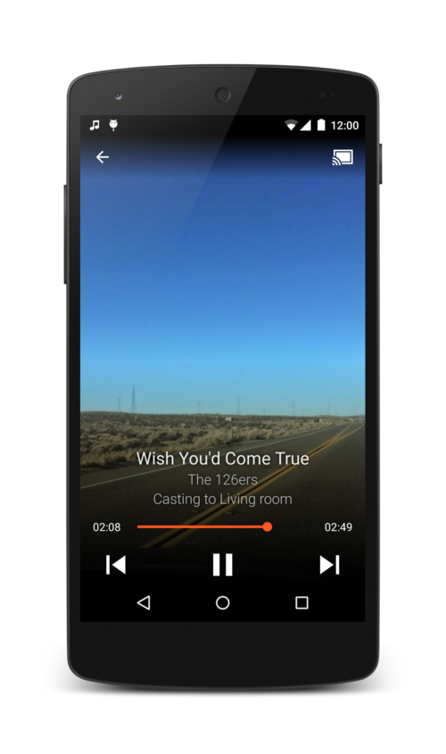

Audiobook Sandbox
=====================================

This is the repository for our proof-of-concept code to display, play, and manipulate audiobooks in SimplyE.
The project is not ready for outside contributions, but we're always happy to hear suggestions.

The project utilizes Google's Universal Music Player sample project.

Pre-requisites
--------------

- Android SDK v17

Interesting Code Locations
--------------------------

- The Table Of Contents nav bar is coded for in com.example.android.uamp.ui.ActionBarCastActivity.populateDrawerItems(). 

Screenshots
-----------

General Outside Support
-----------------------

- Google+ Community: https://plus.google.com/communities/105153134372062985968
- Stack Overflow: http://stackoverflow.com/questions/tagged/android
- https://github.com/googlesamples/android-UniversalMusicPlayer/issues

License For The Google Sample Code We're Using
----------------------------------------------

Copyright 2014 The Android Open Source Project, Inc.

Licensed to the Apache Software Foundation (ASF) under one or more contributor
license agreements.  See the NOTICE file distributed with this work for
additional information regarding copyright ownership.  The ASF licenses this
file to you under the Apache License, Version 2.0 (the "License"); you may not
use this file except in compliance with the License.  You may obtain a copy of
the License at

  http://www.apache.org/licenses/LICENSE-2.0

Unless required by applicable law or agreed to in writing, software
distributed under the License is distributed on an "AS IS" BASIS, WITHOUT
WARRANTIES OR CONDITIONS OF ANY KIND, either express or implied.  See the
License for the specific language governing permissions and limitations under
the License.
